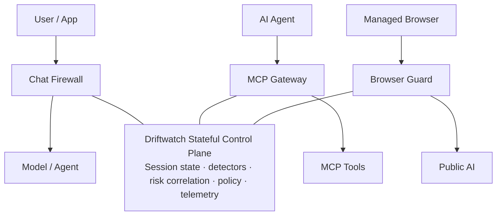

<div align="center">

# 🛡️ Driftwatch — The Firewall That Remembers

### One stateful security model. Three enforcement points.

**Protect the conversation. Protect the agent. Protect the data leaving the browser.**

<p>
  <a href="https://rohitanandriso.github.io/driftwatch/">
    
  </a>
  <a href="https://rohitanandriso.github.io/driftwatch/#videos">
    
  </a>
  <a href="docs/Driftwatch_Technical_Architecture_Deck.pptx">
    
  </a>
</p>

**Microsoft Global Hackathon 2026 · Executive Challenge: Hack to Make Agents Trustworthy**

</div>

---

## What is Driftwatch?

Most AI security decisions are optimized around individual requests and responses. But gradual jailbreaks, secret probing, cumulative data exfiltration, risky tool chains, and browser-based data egress can become dangerous only when activity is correlated over time.

**Driftwatch adds a stateful AI security control plane that remembers the session and enforces policy at three trust boundaries:**

| Trust boundary | What Driftwatch protects | Enforcement |
| --- | --- | --- |
| **Chat Firewall** | Multi-turn AI conversations | ALLOW → FLAG → REDACT → BLOCK → TERMINATE |
| **MCP Gateway** | Agent tool calls and tool results | Inspect → Block risky chain → Quarantine agent |
| **Browser Guard** | Sensitive data leaving a managed browser for public AI | Detect → Warn / Block before submission |

> **Core idea:** do not ask only *“Is this prompt malicious?”* Ask *“Is this entire session becoming malicious?”*

---

## Architecture



The same session-aware security model is applied differently at each boundary. **Owned agents can be terminated and quarantined. Hosted public AI services are protected at the managed-browser egress point.**

---

## 🎬 Watch Driftwatch in action

Three working demonstrations show the prototype across all three trust boundaries.

| Demo | What it shows | Watch |
| --- | --- | --- |
| **Chat Firewall** | Session risk accumulating across turns until enforcement | [▶ Watch Chat Firewall](https://rohitanandriso.github.io/driftwatch/videos/ChatFIrewall.mp4) |
| **MCP Gateway** | Compromised tool path, risky external sink, block and containment | [▶ Watch MCP Gateway](https://rohitanandriso.github.io/driftwatch/videos/MCP.mp4) |
| **Browser Guard** | Synthetic enterprise secret stopped before reaching public AI | [▶ Watch Browser Guard](https://rohitanandriso.github.io/driftwatch/videos/BrowserGuard.mp4) |

**Full experience:** [rohitanandriso.github.io/driftwatch](https://rohitanandriso.github.io/driftwatch/)

---

## Session-level detectors

Driftwatch correlates five signals that become more meaningful when the firewall remembers previous events.

| Detector | Purpose |
| --- | --- |
| **Intent Drift** | Tracks gradual movement from benign intent toward risky behavior |
| **Secret Probing** | Accumulates repeated requests for credentials, keys, passwords, and secrets |
| **Exfiltration Budget** | Measures cumulative sensitive data release across a session |
| **Tool Chain** | Detects risky sequences such as sensitive reads followed by external sinks |
| **Refusal Probing** | Detects repeated refuse → rephrase → retry behavior |

### Verdict ladder

```text
ALLOW  →  FLAG  →  REDACT  →  BLOCK  →  TERMINATE
```

When policy reaches containment threshold, Driftwatch can quarantine an owned compromised agent identity across subsequent model and tool requests until human release.

---

## MCP security boundary

Driftwatch includes a **JSON-RPC 2.0 MCP gateway** that can inspect tool calls and results before they cross the tool boundary.

The prototype demonstrates:

- Tool-call and tool-result inspection
- Untrusted / poisoned tool-output tracking
- Sensitive-read + external-sink correlation
- Risk-aware blocking
- Agent kill switch and quarantine
- Clean and compromised MCP demo modes
- TLS-terminating gateway pattern

---

## Browser Guard

**Driftwatch Browser Guard** protects the managed-browser data-egress boundary before sensitive content reaches public AI services.

The current Chrome / Edge Manifest V3 prototype:

- Intercepts paste events before submission
- Detects high-confidence secret patterns locally
- Covers private keys, JWTs, API keys, bearer tokens, passwords, and connection strings
- Can correlate browser activity with Driftwatch session risk
- Continues basic secret protection if the local backend is unavailable
- Uses synthetic secrets in demonstrations

**Production path:** typed-submit interception, file-upload inspection, managed destination policy, governance context, and centralized security telemetry.

---

## Multilingual demo coverage

Security behavior should not depend on English-only prompts. Driftwatch includes prototype demonstration scenarios for:

**English · French · German · Russian · Hindi · Mandarin**

> Multilingual scenarios are demo validation only and are **not** included in the 94.4% benchmark below.

---

## Current prototype evaluation

Results below come from the **current Driftwatch evaluation corpus and harness**. They are prototype measurements, not independent production benchmarks.

| Metric | Result |
| --- | ---: |
| Multi-turn attacks detected | **94.4%** |
| Per-message baseline on the same multi-turn corpus | **0.0%** |
| Single-turn attacks detected | **100%** |
| Benign false positives in the current corpus | **0.0%** |
| Mean inspection latency | **~1.3 ms** |
| Data-loss reduction on theft attacks | **69.5%** |

The baseline still catches blatant single-message attacks. Driftwatch adds visibility into malicious behavior that emerges **across the session**.

---

## Built today vs. production path

| Working hackathon prototype | Production path |
| --- | --- |
| Stateful Chat Firewall | Real Azure OpenAI target |
| Five session-level detectors | Live Prompt Shields integration |
| JSON-RPC 2.0 MCP gateway | Broader MCP interoperability |
| Kill switch + agent quarantine | Shared session / quarantine store such as Redis |
| Edge / Chrome Browser Guard | Typed-submit + file-upload inspection |
| Multilingual demo scenarios | Expanded multilingual evaluation corpus |
| Evaluation harness + telemetry | Central policy, Purview context, Sentinel workflows |

---

## Microsoft ecosystem integration

Driftwatch is designed as a **complementary security layer**, not a replacement for Microsoft security and AI controls.

- **Azure OpenAI** — production model target
- **Prompt Shields** — per-input attack detection
- **Microsoft Purview** — sensitive-data and governance context
- **Entra Agent ID** — durable non-human identity and containment
- **Microsoft Sentinel** — security telemetry and investigation
- **MCP** — agent tool-boundary inspection

---

## Technical architecture

The technical architecture deck covers the shared control plane, session model, detectors, Chat Firewall, MCP Gateway, Browser Guard, multilingual demonstrations, containment model, deployment architecture, validation scope, and production roadmap.

### [📐 Open Driftwatch Technical Architecture Deck](docs/Driftwatch_Technical_Architecture_Deck.pptx)

---

## Hackathon assets

```text
driftwatch/
├── index.html
├── styles.css
├── script.js
├── videos/
│   ├── ChatFIrewall.mp4
│   ├── MCP.mp4
│   └── BrowserGuard.mp4
└── docs/
    └── Driftwatch_Technical_Architecture_Deck.pptx
```

GitHub Pages publishes the live Driftwatch experience directly from this repository.

---

<div align="center">

### Driftwatch

**The firewall that remembers.**

[Live Experience](https://rohitanandriso.github.io/driftwatch/) · [Working Demos](https://rohitanandriso.github.io/driftwatch/#videos) · [Technical Architecture](docs/Driftwatch_Technical_Architecture_Deck.pptx)

<br/>

© 2026 Made with ❤️ for Microsoft Global Hackathon by **Driftwatch Team**

</div>
